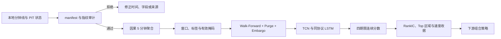

# skill-dl-tcn-shortterm：TCN 短线分钟线预测

`skill-dl-tcn-shortterm` 是一个面向金融分钟线研究的因果 Temporal Convolutional Network（TCN）工具。它使用截至信号日收盘可见的 5 分钟序列，为同一交易日的股票输出未来 `1 / 2 / 3 / 5` 个交易日的连续横截面收益分数，并用相同数据、切分和训练预算的 LSTM 作为基准。

它解决的核心问题不是“自动生成一个可交易组合”，而是回答三个更基础的问题：

1. TCN 是否严格保持因果性，没有通过 padding、标的池、标签或预处理读取未来；
2. TCN 在公平协议下是否具有可复现的预测效果与训练速度；
3. 模型输出能否形成标准、可审计、可被不同 Agent 消费的研究证据。

TCN 只负责预测。TopK、目标权重、持仓批次、换手、容量、成本和成交约束属于下游组合策略。

## 一分钟快速开始

发布后可以从 GitHub 安装 Python 执行引擎：

```powershell
python -m pip install "skill-dl-tcn-shortterm @ git+https://github.com/quantskills/skill-dl-tcn-shortterm.git@main"
```

运行不需要外部数据的接口 canary：

```powershell
tcn-shortterm-skill demo
```

成功时只输出一个版本化 JSON 文档：

```json
{
  "schema_version": "1",
  "status": "success",
  "action": "demo",
  "request_digest": "<sha256>",
  "engine": {
    "name": "skill-dl-tcn-shortterm",
    "version": "0.1.0"
  },
  "run_id": "<immutable-run-id>",
  "authoritative_run_manifest": {
    "status": "success",
    "model": "constant-zero"
  },
  "warnings": [
    "Synthetic demo passed; it does not train or validate a TCN model."
  ],
  "errors": []
}
```

这一步只验证安装、JSON 接口、数据指纹和不可覆盖运行链路。它不会训练 TCN，也不代表模型有效。

发布后，Agent Skills 兼容环境可以安装根 `SKILL.md`：

```powershell
npx skills add quantskills/skill-dl-tcn-shortterm --yes
```

典型调用：

```text
$skill-dl-tcn-shortterm 使用我的本地分钟线运行因果 TCN，并用同协议 LSTM 报告预测效果、训练速度和证据边界。
```

Skill 只负责选择稳定入口、维护模型—策略边界和解释证据。训练、切分、预测与收据始终由同一个 Python 包执行，不需要不同 Agent 各自复制算法。

## TCN 到底预测什么

标准神经网络输入为：

```text
[batch, feature, time]
```

基准序列包含最近 10 个完整交易日，约 `480` 个 5 分钟时间步。模型输出为：

```text
[batch, 4] -> [1d, 2d, 3d, 5d]
```

对外预测记录统一为：

```text
signal_date, instrument_id, horizon, score
```

`score` 只用于同一 `signal_date × horizon` 内的横截面排序。它不是绝对收益率、上涨概率、仓位或交易指令。

## 核心逻辑

### 1. 因果扩张卷积

每层卷积只在左侧补齐历史。任何输出都不得依赖右侧 padding 或未来时间步。指数扩张使浅层网络覆盖较长历史，同时允许不同时间位置并行计算。

### 2. 感受野必须覆盖输入

感受野不能只用“`2^层数`”估算。Bai 双卷积残差块使用：

```text
R = 1 + 2 × (kernel_size - 1) × Σ(dilation)
```

默认 kernel size 为 `3`，dilation 为 `1, 2, 4, 8, 16, 32, 64`，实际感受野为 `509`，可以覆盖 480 步输入。任何新配置在训练前都必须重新计算；`R < input_length` 时直接拒绝。

### 3. WeightNorm，不使用 BatchNorm

时序样本跨日期、证券和市场状态分布变化明显。默认残差块使用 WeightNorm；不通过 BatchNorm 混合批次统计获得表面改善。

### 4. Point-in-Time 数据

股票池、上市状态、停牌状态、公司行为、ADV20、市值和行业字段只能使用信号时点已经可见的版本。禁止使用今天的成分股回填历史，禁止把未来复权、未来停牌或未来标签派生字段放入输入。

### 5. Walk-Forward、Purge 与 Embargo

样本按 `signal_date` 顺序切分。每个边界根据真实 `label_end_at` 删除标签跨界的训练样本，再独立记录 embargo。标准化、裁剪、特征选择和其他可学习预处理每折只在训练段拟合。

### 6. 大样本流式加载

五年分钟线不应整体复制进内存或仓库。规范数据使用 Parquet/Arrow，窗口缓存使用只读 memmap，并通过 manifest、SHA-256 和运行 ID 绑定来源。

### 7. 公平 LSTM 基准

TCN 与 LSTM 必须固定数据、fold、seed、线程、batch、精度、epoch/停止规则和评估代码。速度同时报告模型 step、数据管线、完整训练—验证周期和推理吞吐，不能互相替代。

## 整体工作流程



推荐顺序：

1. 准备本地数据和 manifest；
2. 先审计时间、PIT 状态和数据指纹；
3. 冻结 fold、seed、训练预算和比较协议；
4. 运行 TCN 与 LSTM；
5. 联合解释预测效果、稳定性和速度；
6. 输出连续分数给组合层；
7. 不用组合层局部参数反向改写模型结论。

## 单一 Agent 接口

不同 Agent 只需要理解一个命令：

```powershell
tcn-shortterm-skill run --request .\request.json
```

等价模块入口：

```powershell
python -m skill_dl_tcn_shortterm run --request .\request.json
```

`request.json` 只有五个字段：

```json
{
  "schema_version": "1",
  "action": "run",
  "config_path": "config.json",
  "manifest_path": "manifest.json",
  "output_root": "runs"
}
```

相对路径以 `request.json` 所在目录为准。未知字段、无效 JSON、缺失文件、数据指纹漂移或重复运行 ID 都会 fail closed，并以退出码 `2` 返回一个标准失败 JSON。

查看准确机器协议：

```powershell
tcn-shortterm-skill schema --kind request
tcn-shortterm-skill schema --kind result
```

## 生成最小接口样例

执行：

```powershell
tcn-shortterm-skill example --output-dir .\my-tcn-run
```

生成一个扁平目录：

```text
my-tcn-run/
├── samples.parquet
├── manifest.json
├── config.json
└── request.json
```

然后运行：

```powershell
tcn-shortterm-skill run --request .\my-tcn-run\request.json
```

该样例只验证 Agent 接口，使用的是最小 `prebuilt_samples` 和零预测 canary。要真正训练 TCN，必须替换为满足下一节契约的分钟线数据和配置。

## 使用自己的分钟线

### 行情文件

`raw_1m` Parquet 至少需要：

```text
instrument_id, bar_end_at, open, high, low, close, volume, amount, quality_flag
```

时间戳必须包含明确时区。午休、隔夜和停牌空档不能被伪造成连续 bar。

### PIT 状态文件

要构造训练窗口，manifest 必须同时声明 `instrument_state_path` 及其 SHA-256。状态文件至少需要能在每个信号日判断证券类型、上市/退市、ST/退市整理、停牌以及其他准入状态。可选的公司行为与执行状态文件继续使用独立路径和指纹。

### manifest.json

最小结构如下：

```json
{
  "schema_version": 1,
  "dataset_kind": "raw_1m",
  "timezone": "Asia/Shanghai",
  "price_unit": "CNY",
  "volume_unit": "share",
  "amount_unit": "CNY",
  "source_version": "my-pit-minute-data-v1",
  "data_path": "bars.parquet",
  "data_sha256": "<sha256>",
  "instrument_state_path": "instrument-state.parquet",
  "instrument_state_sha256": "<sha256>"
}
```

系统不会通过文件名猜测字段角色，也不会登录数据供应商补齐缺失内容。

### config.json

下面是公开 CLI 与已验证研究主路径对齐的推荐配置：

```json
{
  "run_name": "my-tcn-study",
  "seed": 7,
  "horizons": [1, 2, 3, 5],
  "lookback_days": 10,
  "walk_forward": {
    "train_days": 600,
    "validation_days": 100,
    "embargo_days": 5,
    "test_days": 100,
    "max_folds": 5
  },
  "data_loader": {
    "num_workers": 0
  },
  "optimized_tcn": {
    "enabled": true,
    "profile": "v40-portable",
    "relative_features": true,
    "torch_threads": 8,
    "epochs": 8,
    "batch_size": 128,
    "learning_rate": 0.003
  },
  "performance": {
    "enabled": true,
    "models": ["lstm", "optimized-tcn-v40-portable"],
    "hidden_size": 34,
    "tcn_channels": 16,
    "kernel_size": 3,
    "dilations": [1, 2, 4, 8, 16, 32, 64, 128],
    "optimized_tcn_profile": "v40-portable",
    "torch_threads": 8,
    "epochs": 8,
    "batch_size": 128,
    "learning_rate": 0.003,
    "device": "cpu"
  }
}
```

`optimized_tcn` 使用 V40 已验证、V42 student 复用的可移植学生核心，不需要教师 checkpoint。旧 `tcn.enabled` 仍保留为基础 Bai TCN 兼容路径；两者不是同一个性能实现。训练期长度应根据真实覆盖范围注册，不能为了让某次运行通过而事后缩短。

## Python 接口

Agent、Notebook 或其他 Python 应用可以复用同一个深模块：

```python
from skill_dl_tcn_shortterm import run_agent_request

result = run_agent_request("request.json")
print(result["status"])
print(result["authoritative_run_manifest"])
```

需要在 Python 中直接构造配置时，可使用底层研究入口：

```python
from skill_dl_tcn_shortterm import run_experiment

run = run_experiment(
    config=config,
    manifest_path="manifest.json",
    output_root="runs",
)
print(run.run_id)
```

大多数 Agent 应优先使用版本化请求接口；底层入口适合已经负责配置治理的 Python 调用方。

## 如何判断预测结果

至少联合检查：

- 每个 fold、seed 和 horizon 的有效样本数；
- 保留训练样本的信息区间重叠是否为零；
- 日度横截面 RankIC 及其置信区间；
- Top excess return 与 NDCG@Top；
- 不同 seed、fold 和 horizon 的方向一致性；
- TCN/LSTM model-step 与完整周期速度比；
- 数据、配置、模型和 checkpoint 指纹；
- `sealed_test_accessed`、`alpha_ready`、`deployment_authorized` 和 `trading_authorized`。

三个常被混淆的指标必须分开：

| 指标 | 含义 |
|---|---|
| `top_membership_precision` | 预测 Top 与实际收益 Top 的集合重合率 |
| `top_positive_return_rate` | 预测 Top 中原始收益大于零的比例 |
| `top_above_cross_section_mean_rate` | 预测 Top 中收益高于同期横截面均值的比例 |

集合重合率不是正收益命中率。RankIC 是 TCN 与 LSTM 的共同连续分数契约，但不能单独覆盖全部 Top 区域或经济效用。

## 当前真实证据

冻结的 2025-04-07 至 2025-12-23 独立窗口得到：

| 模型 | RankIC | 角色 |
|---|---:|---|
| true-target/control TCN | `0.021199` | 当前稳定研究参考 |
| V42 consensus student | `0.022038` | 冻结研究变体 |
| LSTM | `0.018008` | 同协议 benchmark |

V42 student 相对 control TCN 的 RankIC 只增加 `0.000839`，置信下界、Top excess return 和 NDCG 门未通过，正式状态为 `v46_student_not_generalized`。因此不能把 V42 自动晋级为默认模型。

父训练证据中的 TCN/LSTM model-step 速度比为 `4.8789x`，达到本项目原定 3–5 倍目标区间。该数字来自冻结的同预算 CPU 训练协议，不是跨硬件、跨数据和跨实现的普遍承诺。

V47 已把同一个可移植优化模型接入公开 CLI。2021–2025 Top50 原始分钟线的同协议复跑得到 model-step `4.0478x`、end-to-end `3.6474x`；速度门通过。该窗口中 optimized TCN 与 LSTM 的 mean validation RankIC 分别为 `0.079133` 和 `0.094083`，TCN-LSTM 为 `-0.014950`，所以预测非劣门未通过。完整证据见 `docs/research/tcn-public-cli-optimized-v47-results.md`。

当前可以引用的结论是：**TCN 在本项目约束下具有预测—速度研究价值，但没有证据证明 TCN 必然优于 LSTM。**

## 模型与组合策略的职责

| 模块 | 负责 | 不负责 |
|---|---|---|
| TCN 预测模块 | 四期限连续分数、模型稳定性、训练速度 | TopK、目标权重、换手和成交 |
| 组合策略模块 | 分数到持仓、vintage、缓冲、容量、成本 | 改写模型预测质量 |
| 验证模块 | PIT、切分、指标、指纹和证据状态 | 盈利承诺或部署授权 |

换手率是组合构建结果，不是 TCN 必须直接优化的目标。组合层可以在不重训 TCN 的情况下替换权重、缓冲和成交规则。

## 跨 Agent 兼容性

本项目不要求特定 Agent 平台：

- Agent Skills 标准入口：根 `SKILL.md`；
- Codex 可选 UI 元数据：`agents/openai.yaml`；
- 通用执行 seam：`tcn-shortterm-skill run --request ...`；
- 通用机器协议：UTF-8 JSON、JSON Schema 和进程退出码；
- Python fallback：`python -m skill_dl_tcn_shortterm`；
- 不依赖 MCP、Hermes、WSL、固定工作目录、浏览器会话或供应商登录；
- Windows、Linux 和 macOS 使用相同 Python 核心。

其他 Agent 即使忽略 `agents/openai.yaml`，仍可读取 `SKILL.md`、生成请求 JSON 并调用同一个 CLI。

## 当前限制

- `demo` 和 `example` 只验证接口，不训练 TCN；
- 项目不下载真实数据，不验证供应商声明的外部真实性；
- 当前研究市场契约是沪深 A 股普通股，不应静默套用到期货、加密资产或其他交易制度；
- V46 独立窗口已经消费，不得用于新的调参或模型选择；
- 预测分数不等于可执行组合，离线指标不等于实际成交；
- 不连接券商、不发送订单、不写外部数据库、不提供生产或交易授权；
- 不承诺收益，也不宣称 TCN 普遍优于 LSTM。

## 发布结构

```text
skill-dl-tcn-shortterm/
├── SKILL.md
├── agents/openai.yaml
├── references/
├── src/skill_dl_tcn_shortterm/
├── tests/
├── pyproject.toml
└── README.md
```

Skill 文档只描述稳定工作流；Python 包是唯一算法实现；`references/` 按需提供模型、数据和证据契约。真实数据、凭据、缓存、运行产物、本机路径和内部会话记录不属于发布内容。

## 本地验证

```powershell
python -m pip install -e ".[dev]"
python -m ruff check .
python -m mypy
python tasks/preflight.py
python tasks/test.py
python -m build
tcn-shortterm-skill demo
```

所有通过状态都只说明当前代码和接口满足已声明契约，不自动产生 Alpha、部署或交易授权。
